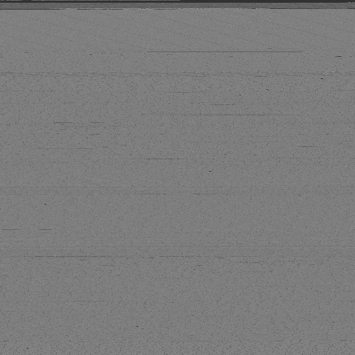
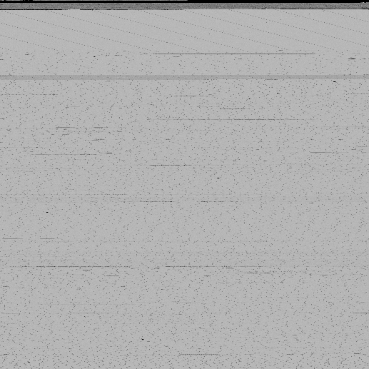

## Entropy
Binary file entropy visualizer written in Python.

*17mb binary, blocksize of 64*

Inspired by [Red Balloon](https://youtu.be/zvP2FEfOSsk?t=619)

### Dependencies
* [Python 3](https://python.org)
* [Pillow library](https://python-pillow.org/)
* [Numpy library](https://numpy.org)

### Installation
`pip install -r requirements.txt`

### Running
Run `python entropy.py filename [blocksize:optional]`

Darker areas have lower entropy.

### Other Examples

*17mb binary, blocksize of 16*

*17mb binary, blocksize of 256*
